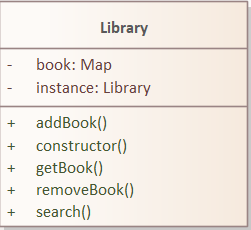
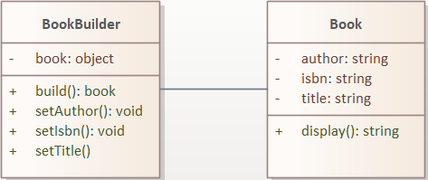
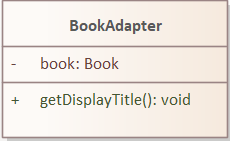
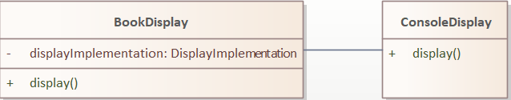
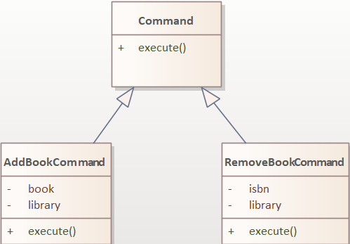
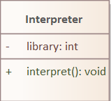

# Biblioteca digitala
## SOLID
### 1. Principiul responsabilității unice

Principiul responsabilității unice (SRP): Fiecare clasă are o singură responsabilitate și se concentrează doar pe acea responsabilitate. Aceasta ajută la menținerea coeziunii și la separarea preocupărilor.
	Clasa Library se ocupă exclusiv de operațiunile de adăugare, eliminare și căutare a cărților în bibliotecă. Nu se amestecă cu alte aspecte, cum ar fi afișarea sau construirea obiectelor Book. Aceasta demonstrează respectarea principiului SRP prin concentrarea pe o singură responsabilitate.
```
class Library {
  constructor() {
    // ...
  }
  addBook(book) {
    this.books.set(book.isbn, book);
  }
  removeBook(isbn) {
    this.books.delete(isbn);
  }
  getBook(isbn) {
    return this.books.get(isbn);
  }
  search(query) {
    // ...
  }
}	
```
Clasa Book stochează informațiile despre o carte și oferă o metodă display() pentru a obține o reprezentare a cărții sub formă de șir de caractere. Nu se ocupă de operațiuni de gestionare a bibliotecii sau de construirea obiectelor. Aceasta respectă principiul SRP prin îndeplinirea unei singure responsabilități.
```
class Book {
  constructor({ title, author, isbn }) {
    // ...
  }

  display() {
    return `${this.title} by ${this.author} (ISBN: ${this.isbn})`;
  }
}
```
### 2. Principiul deschiderii-închiderii

Principiul deschiderii-închiderii (OCP): Codul este extensibil fără a fi nevoie de modificări în clasele existente. Acest lucru este realizat prin intermediul conceptelor de construirea obiectelor de tip Book prin intermediul BookBuilder și de adaptare a cărților prin intermediul BookAdapter.

Clasa BookDisplay este proiectată pentru a fi deschisă pentru extensie, prin intermediul injecției de dependențe a clasei de implementare. Aceasta utilizează o interfață comună display() pentru afișarea cărților, iar clasele ConsoleDisplay și HtmlDisplay oferă implementări specifice. Astfel, atunci când este necesară o nouă formă de afișare (de exemplu, afișare într-o aplicație web), putem extinde clasa BookDisplay prin crearea unei noi clase de implementare și injectând-o în BookDisplay, fără a modifica codul existent.
```
class BookDisplay {
  constructor(displayImplementation) {
    this.displayImplementation = displayImplementation;
  }

  display(book) {
    return this.displayImplementation.display(book);
  }
}

class ConsoleDisplay {
  display(book) {
    return book.display();
  }
}

class HtmlDisplay {
  display(book) {
    return `<div>${book.display()}</div>`;
  }
}
```
### 3. Principiul substituției Liskov

Principiul substituției Liskov (LSP): Subclasa SpecialBook este o extensie a clasei de bază Book și respectă contractul și comportamentul clasei de bază. Astfel, poate fi utilizată în locul clasei de bază fără a afecta corectitudinea programului.

Clasa SpecialBook extinde clasa de bază Book și suprascrie metoda display(). Aceasta adaugă un comportament special la reprezentarea cărții prin adăugarea prefixului "Special:". Cu toate acestea, clasa SpecialBook respectă contractul și comportamentul clasei de bază Book, deci poate fi utilizată în locul clasei de bază fără a afecta corectitudinea programului. Acest lucru demonstrează aplicarea Principiului Substituției Liskov.
```
class SpecialBook extends Book {
  display() {
    return `Special: ${super.display()}`;
  }
}
```
### 4. Principiul inversării dependențelor

Principiul inversării dependențelor (DIP): Clasa Library depinde de o abstractizare, adică de interfața reprezentată de Map, în loc să depindă direct de o implementare specifică. Aceasta facilitează flexibilitatea și schimbul de implementări.

Clasa Library primește o instanță a map-ului de cărți ca parametru în constructorul său. Aceasta permite flexibilitate în ceea ce privește sursa și implementarea map-ului de cărți. Putem furniza o implementare specifică a map-ului sau putem înlocui map-ul existent cu un alt tip de stocare fără a modifica clasa Library în sine.
```
class Library {
  constructor(booksMap) {
    this.books = booksMap;
  }

  // ...
}

const booksMap = new Map();
const library = new Library(booksMap);
```
### 5. Principiul înlocuirii dependențelor

Principiul înlocuirii dependențelor (ISP): Nu există utilizarea directă a acestui principiu în codul furnizat, dar este posibil să fie aplicat în alte părți ale aplicației.
* Clasa Book și clasele derivate (precum SpecialBook) oferă o interfață comună prin intermediul metodei display(). Aceasta este o interfață simplă și coerentă care definește comportamentul de afișare al cărții. Prin urmare, se evită implementarea unor metode nedorite sau neutilizate în clasele care nu le necesită.
* Clasa BookAdapter oferă o interfață simplificată și specializată pentru a accesa doar metoda getDisplayTitle() a cărții. Aceasta permite utilizarea unei cărți într-un context specific fără a expune toate metodele din clasa Book. Astfel, se asigură o interfață specifică și restrânsă în funcție de nevoile utilizării respective.

## DESIGN PATTERNS

### 1. Singleton
Singleton este un pattern de design care permite crearea unei singure instanțe a unei clase și asigură faptul că orice încercare de a crea o nouă instanță va returna aceeași instanță deja existentă.
```
class Library {
  constructor() {
    if (Library.instance) {
      return Library.instance;
    }

    this.books = new Map();
    Library.instance = this;
  }
```
Constructorul clasei verifică dacă există deja o instanță a clasei Library și returnează acea instanță dacă există. În caz contrar, construiește o nouă instanță și o stochează într-un câmp static numit instance. Această abordare garantează că există doar o singură instanță a clasei Library în întreaga aplicație.

Astfel, dacă se încearcă crearea unei noi instanțe a clasei Library, se va returna instanța deja existentă, fără a se crea o nouă instanță.
	
- Un exemplu de utilizare a acestui singleton este adăugarea și eliminarea cărților din bibliotecă, astfel încât biblioteca să rămână întotdeauna unică și coerentă.
```
const library = new Library();
// Adăugare carte
const bookBuilder = new BookBuilder();
const book1 = bookBuilder
  .setTitle('Măștile fricii')
  .setAuthor('Camelia Cavadia')
  .setIsbn('1234567890')
  .build();
library.addBook(book1);

// Eliminare carte
library.removeBook('1234567890');
```
În acest exemplu, clasa Library este apelată în mod indirect prin intermediul metodelor addBook și removeBook, care adaugă și elimină cărți din bibliotecă.
	
- O altă utilizare a singletonului este în clasa Interpreter, care primește comenzi de la utilizator, iar atunci când primește comanda "add", creează o nouă carte utilizând clasa BookBuilder, și apoi adaugă cartea în bibliotecă utilizând clasa AddBookCommand. Clasa Interpreter are o referință la instanța singleton a clasei Library, astfel încât poate adăuga cartea în bibliotecă utilizând metoda addBook.
```
class Interpreter {
  constructor(library) {
    this.library = library;
  }

  interpret(input) {
    const tokens = input.split(' ');
    const command = tokens[0].toLowerCase();

    if (command === 'add') {
      const title = tokens[1];
      const author = tokens[2];
      const isbn = tokens[3];

      const bookBuilder = new BookBuilder();
      const book = bookBuilder
        .setTitle(title)
        .setAuthor(author)
        .setIsbn(isbn)
        .build();

      const addBookCommand = new AddBookCommand(this.library, book);
      addBookCommand.execute();
    } else if (command === 'remove') {
      const isbn = tokens[1];
      const removeBookCommand = new RemoveBookCommand(this.library, isbn);
      removeBookCommand.execute();
    } else {
      console.log('Invalid command');
    }
  }
}

const library = new Library();
const interpreter = new Interpreter(library);

interpreter.interpret('add Oamenii_din_Dublin James_Joyce 0987654321');

console.log(library.getBook('0987654321'));
```
În acest exemplu, clasa Interpreter utilizează singleton-ul pentru a asigura că instanța clasei Library este unică și coerentă în ceea ce privește adăugarea și eliminarea cărților din bibliotecă. 

În general, singletonul este util atunci când trebuie să ne asigurăm că există o singură instanță a unei clase și când această instanță trebuie să fie accesibilă global.
#### Schema UML

##### Descriere:

În schema UML a clasei Library, putem observa următoarele elemente două atribute:
* instance: atribut privat care reține o instanță a clasei Library în cadrul implementării Singleton.
* books: atribut privat de tip Map care stochează cărțile din bibliotecă, utilizând numerele ISBN ca chei.
Metodele disponibile în clasa Library sunt:
* constructor(): Este constructorul clasei Library care se ocupă de implementarea Singleton și inițializarea atributelor.
* addBook(book: Book): void: Adaugă o carte în bibliotecă.
* removeBook(isbn: string): void: Elimină o carte din bibliotecă. 
* getBook(isbn: string): Book: Returnează o carte din bibliotecă. 
* search(query: string): Book[]: Caută cărți în bibliotecă pe baza unui șir de căutare și returnează un tablou de cărți care se potrivesc.


### 2. Builder
Pattern-ul Builder este o metodă de construire a obiectelor complexe, în care obiectul este construit pas cu pas. Fiecare pas este reprezentat de o metodă a clasei Builder, care setează o proprietate a obiectului ce urmează să fie creat.
	
Clasa BookBuilder este implementată ca un Builder, iar clasa Book reprezintă obiectul complex ce urmează să fie creat.
```
class BookBuilder {
  constructor() {
    this.book = {};
  }
  ```
În constructorul clasei BookBuilder, se inițializează obiectul book ca un obiect gol, cu proprietățile necompletate. Această metodă este utilă atunci când dorim să creăm un obiect Book, dar nu știm încă valorile pentru proprietățile acestuia.
	
Pentru a completa proprietățile obiectului Book, clasa BookBuilder are metode specifice pentru fiecare proprietate a obiectului Book. Aceste metode sunt definite ca metode ale clasei și primesc valoarea corespunzătoare proprietății ca argument, setând astfel valoarea proprietății obiectului book ce urmează să fie creat.
```
setTitle(title) {
    this.book.title = title;
    return this;
}

setAuthor(author) {
    this.book.author = author;
    return this;
}

setIsbn(isbn) {
    this.book.isbn = isbn;
    return this;
}
```
Toate aceste metode returnează instanța curentă a obiectului BookBuilder (this), permițând astfel setarea mai multor proprietăți la un moment dat, prin concatenarea metodelor de setare a proprietăților.
	
La final, metoda build este utilizată pentru a crea obiectul Book folosind valorile setate pentru proprietățile acestuia prin apelurile anterioare ale metodelor din clasa BookBuilder. În cadrul metodei build, este creată o nouă instanță a clasei Book utilizând obiectul this.book ca argument.

```
build() {
  return new Book(this.book);
}
```

Acest pattern de design este util atunci când dorim să creăm obiecte complexe cu proprietăți multiple, dar nu dorim să definim constructori cu un număr mare de parametri. Prin intermediul pattern-ului Builder, putem construi obiectul pas cu pas, în funcție de necesități, permițând astfel o construcție mai flexibilă și mai ușor de înțeles a obiectelor complexe.
#### Schema UML


##### Descriere:

Clasa BookBuilder este reprezentată ca o clasă cu o singură membru de date privat book, care este un obiect gol. Metodele sale sunt publice și permit setarea atributelor title, author și isbn ale cărții. Aceste metode returnează instanța curentă a obiectului BookBuilder, permițând astfel utilizarea în lanț a metodelor de setare. Metoda build() creează și returnează un obiect de tip Book pe baza atributelor setate în obiectul book. Clasa Book are trei membri de date privați: title, author și isbn, care stochează informațiile despre carte. Ea conține, de asemenea, o metodă publică display() care returnează o reprezentare textuală a cărții în formatul "title by author (ISBN: isbn)". Relația dintre cele două clase este de asociere, deoarece BookBuilder utilizează clasa Book pentru a construi și returna obiecte de tip Book.

### 3. Adapter
Pattern-ul Adapter este utilizat atunci când trebuie să adaptăm o interfață existentă a unei clase la o altă interfață a unei alte clase sau a unei biblioteci, astfel încât să putem utiliza acea clasă sau bibliotecă într-un mod compatibil cu codul nostru existent.

Clasa BookAdapter este un adapter între interfața obiectelor de tip Book și interfața de afișare BookDisplay. Clasa BookDisplay utilizează o implementare a interfeței DisplayImplementation pentru a afișa informațiile despre cartea dată. Interfața DisplayImplementation expune o singură metodă display, care primește un obiect de tip Book și returnează un șir de caractere cu informațiile despre acea carte.
```
class BookDisplay {
  constructor(displayImplementation) {
    this.displayImplementation = displayImplementation;
  }

  display(book) {
    return this.displayImplementation.display(book);
  }
}

class ConsoleDisplay {
  display(book) {
    return `${book.title} by ${book.author} (ISBN: ${book.isbn})`;
  }
}
```
Clasa BookAdapter este utilizată pentru a permite utilizarea obiectelor de tip Book în cadrul interfeței DisplayImplementation. Aceasta primește un obiect de tip Book și îl convertește la o formă adecvată pentru interfața DisplayImplementation. În exemplul dat, clasa BookAdapter utilizează o metodă getDisplayTitle, care returnează titlul și autorul cărții, formatat sub forma unui șir de caractere.
```
class BookAdapter {
  constructor(book) {
    this.book = book;
  }

  getDisplayTitle() {
    return `${this.book.title} by ${this.book.author}`;
  }
}
```
Prin intermediul clasei BookAdapter, obiectele de tip Book pot fi utilizate în cadrul interfeței DisplayImplementation. În exemplul dat, este creată o instanță a clasei BookAdapter, care primește un obiect de tip Book și apoi metoda getDisplayTitle a acestei instanțe este utilizată pentru a afișa titlul și autorul cărții în cadrul interfeței BookDisplay.
```
const book1 = new Book({
  title: 'Măștile fricii',
  author: 'Camelia Cavadia',
  isbn: '1234567890'
});

const bookAdapter = new BookAdapter(book1);
console.log(bookAdapter.getDisplayTitle());
```
Acest pattern de design este util atunci când trebuie să utilizăm o clasă existentă sau o bibliotecă care nu corespunde interfeței de cod existentă, fără a modifica codul acelei clase sau biblioteci. Prin intermediul unui adapter, putem adapta interfața clasei existente la interfața de cod existentă, permițând astfel utilizarea acelei clase sau biblioteci într-un mod compatibil cu codul nostru existent.
#### Schema UML


##### Descriere:

Clasa BookAdapter este reprezentată ca o clasă cu un singur membru de date privat book, care este o referință la un obiect de tip Book. Constructorul clasei primește un obiect book ca argument și îl stochează în membrul de date book.Clasa BookAdapter conține o singură metodă publică, getDisplayTitle(), care utilizează obiectul book pentru a apela metoda display() a acestuia și returnează rezultatul. Scopul clasei BookAdapter este de a adapta interfața obiectului Book într-o altă interfață așteptată de alte componente ale sistemului. În acest caz, BookAdapter oferă o metodă getDisplayTitle() care furnizează o interfață convenabilă pentru a obține titlul cărții din obiectul book și de a-l utiliza în alte contexte. Prin intermediul clasei BookAdapter, obiectele de tip Book pot fi utilizate într-un mod mai flexibil și compatibil cu alte componente ale aplicației.
Clasa BookAdapter are următoarele caracteristici:
•	book (atribut privat): stochează referința către un obiect de tip Book.
•	getDisplayTitle(): o metodă publică care utilizează obiectul book pentru a apela metoda display() a acestuia și returnează rezultatul.

### 4. Bridge
Pattern-ul Bridge este utilizat atunci când trebuie să separăm o interfață de la implementarea acesteia, permițând astfel modificarea sau înlocuirea implementării fără a afecta interfața.
	
Clasa BookDisplay utilizează pattern-ul Bridge pentru a separa interfața DisplayImplementation de implementarea acesteia, permițând utilizarea diferitelor implementări ale interfeței fără a afecta interfața BookDisplay.
```
class BookDisplay {
  constructor(displayImplementation) {
    this.displayImplementation = displayImplementation;
  }

  display(book) {
    return this.displayImplementation.display(book);
  }
}
```
Clasa BookDisplay conține un constructor care primește o implementare a interfeței DisplayImplementation. Aceasta utilizează implementarea primită pentru a afișa informațiile despre cartea dată. Interfața DisplayImplementation este separată de interfața BookDisplay, permițând utilizarea diferitelor implementări ale interfeței DisplayImplementation fără a afecta clasa BookDisplay.

Clasa ConsoleDisplay este o implementare a interfeței DisplayImplementation, care afișează informațiile despre cartea dată în consolă, iar clasa BookDisplay este utilizată pentru a afișa informațiile despre cartea dată prin intermediul acestei implementări.
```
class ConsoleDisplay {
  display(book) {
    return `${book.title} by ${book.author} (ISBN: ${book.isbn})`;
  }
}

const book1 = new Book({
  title: 'Măștile fricii',
  author: 'Camelia Cavadia',
  isbn: '1234567890'
});

const consoleDisplay = new ConsoleDisplay();
const bookDisplay = new BookDisplay(consoleDisplay);

console.log(bookDisplay.display(book1));
```
Clasa BookDisplay este utilizată pentru a afișa informațiile despre cartea dată prin intermediul implementării ConsoleDisplay. Mai precis, este creată o instanță a clasei ConsoleDisplay, iar apoi această instanță este transmisă către constructorul clasei BookDisplay. Ulterior, metoda display a instanței clasei BookDisplay este utilizată pentru a afișa informațiile despre cartea dată prin intermediul acestei implementări.
	
Acest pattern de design este util atunci când dorim să separăm interfața de implementarea acesteia, permițând astfel utilizarea diferitelor implementări ale acestei interfețe într-un mod flexibil și modular. Prin intermediul pattern-ului Bridge, putem separa interfața de implementarea acesteia, permițând astfel modificarea sau înlocuirea implementării fără a afecta interfața.
#### Schema UML


##### Descriere:

Clasa BookDisplay reprezintă clasa abstractă a Bridge. Aceasta are un membru privat displayImplementation de tip DisplayImplementation, care reprezintă implementarea concretă a afișării cărții. Clasa BookDisplay oferă o metodă publică display(book) pentru a afișa o carte utilizând implementarea specificată. Clasa ConsoleDisplay reprezintă implementarea concretă a afișării cărții. Aceasta implementează interfața DisplayImplementation și oferă o metodă publică display(book) pentru a afișa o carte în consolă. Interfața DisplayImplementation definește metoda display(book) pe care trebuie să o implementeze toate clasele de implementare concretă a afișării. Pattern-ul Bridge separă interfața de afișare (BookDisplay) de implementarea concretă a afișării (ConsoleDisplay). Astfel, putem extinde sistemul prin adăugarea altor clase de implementare a afișării fără a modifica codul existent din BookDisplay. Asta ne oferă flexibilitate și extensibilitate în gestionarea diferitelor moduri de afișare a cărții. BookDisplay este clasa care facilitează afișarea unei cărți utilizând o implementare specifică, definită prin interfața DisplayImplementation. Aceasta are o proprietate displayImplementation care reține o referință către obiectul de implementare. ConsoleDisplay este o clasă concretă care implementează interfața DisplayImplementation. Ea conține metoda display(book) pentru a afișa o carte pe consolă. Metoda display(book) din ConsoleDisplay este apelată de către BookDisplay pentru a afișa cărțile pe consolă.

### 5. Command
  Pattern-ul Command este utilizat atunci când trebuie să separăm o cerere sau o acțiune de la obiectul care o primește sau o execută. Acest pattern permite encapsularea unei cereri ca obiect, permițând astfel transmiterea acesteia ca argument, stocarea într-o coadă, trimiterea prin rețea sau salvarea într-un fișier.

Clasele AddBookCommand și RemoveBookCommand sunt comenzi care encapsulează acțiunile de adăugare și eliminare a cărților din bibliotecă. Aceste clase au o metodă „execute” care efectuează acțiunea specifică.
```
class AddBookCommand {
  constructor(library, book) {
    this.library = library;
    this.book = book;
  }

  execute() {
    this.library.addBook(this.book);
  }
}

class RemoveBookCommand {
  constructor(library, isbn) {
    this.library = library;
    this.isbn = isbn;
  }

  execute() {
    this.library.removeBook(this.isbn);
  }
}
```
În exemplul dat, instanțele acestor clase sunt utilizate pentru a executa comenzi de adăugare și eliminare a cărților din bibliotecă. Aceste instanțe pot fi utilizate într-o varietate de moduri, cum ar fi prin intermediul unei interfețe de utilizator, prin intermediul unei cozi sau prin intermediul unei rețele.
```
const library = new Library();

const book1 = new Book({
  title: 'Măștile fricii',
  author: 'Camelia Cavadia',
  isbn: '1234567890'
});

const addBookCommand = new AddBookCommand(library, book1);
addBookCommand.execute();

console.log(library.getBook('1234567890'));

const removeBookCommand = new RemoveBookCommand(library, '1234567890');
removeBookCommand.execute();

console.log(library.getBook('1234567890'));
```
În exemplul dat, instanța clasei AddBookCommand este utilizată pentru a adăuga cartea book1 în bibliotecă prin intermediul metodei execute. Apoi, instanța clasei RemoveBookCommand este utilizată pentru a elimina cartea book1 din bibliotecă prin intermediul metodei execute.

Acest pattern de design este util atunci când dorim să separăm cererea sau acțiunea de obiectul care o primește sau o execută, permițând astfel encapsularea cererii sau acțiunii ca obiect. Prin intermediul pattern-ului Command, putem efectua operațiuni asupra obiectelor într-un mod flexibil și modular, permițând astfel transmiterea, stocarea sau trimiterea acțiunilor ca argumente.
#### Schema UML

##### Descriere:

Clasa Command este clasa de bază abstractă care definește metoda execute(). Aceasta are rolul de a forța toate clasele de comandă să implementeze această metodă. Clasa AddBookCommand extinde clasa Command și implementează metoda execute(). Această clasă reprezintă o comandă pentru a adăuga o carte în bibliotecă. Ea primește o referință către obiectul library și obiectul book în constructor și, atunci când metoda execute() este apelată, adaugă cartea în bibliotecă prin intermediul metodei addBook() a obiectului library. Clasa RemoveBookCommand extinde, de asemenea, clasa Command și implementează metoda execute(). Această clasă reprezintă o comandă pentru a elimina o carte din bibliotecă. Ea primește o referință către obiectul library și un cod ISBN în constructor și, atunci când metoda execute() este apelată, elimină cartea din bibliotecă prin intermediul metodei removeBook() a obiectului library. Schema UML ilustrează relația de asociere între clasele Command și subclasele sale, precum și între clasa Library și subclasele AddBookCommand și RemoveBookCommand. Aceasta arată cum comenzile utilizează obiectul Library pentru a executa acțiuni specifice, cum ar fi adăugarea sau eliminarea cărților.
### 6. Interpreter
Pattern-ul Interpreter este utilizat atunci când dorim să interpretăm un limbaj sau un format specific prin intermediul unui arbore sintactic. Acest pattern permite definirea unei gramatici formale pentru limbajul sau formatul specific și apoi interpretarea expresiilor din acest limbaj sau format prin intermediul acestui arbore sintactic.

Clasa Interpreter primește o comandă sub formă de șir de caractere și o interpretează prin intermediul unui arbore sintactic simplu. Această clasă are o referință la instanța singleton a clasei Library și poate adăuga sau elimina cărți din bibliotecă în funcție de comanda primită.

```
class Interpreter {
  constructor(library) {
    this.library = library;
  }

  interpret(input) {
    const tokens = input.split(' ');
    const command = tokens[0].toLowerCase();

    if (command === 'add') {
      const title = tokens[1];
      const author = tokens[2];
      const isbn = tokens[3];

      const bookBuilder = new BookBuilder();
      const book = bookBuilder
        .setTitle(title)
        .setAuthor(author)
        .setIsbn(isbn)
        .build();

      const addBookCommand = new AddBookCommand(this.library, book);
      addBookCommand.execute();
    } else if (command === 'remove') {
      const isbn = tokens[1];
      const removeBookCommand = new RemoveBookCommand(this.library, isbn);
      removeBookCommand.execute();
    } else {
      console.log('Invalid command');
    }
  }
}
```
În exemplul dat, instanța clasei Interpreter primește un șir de caractere ca argument și îl interpretează prin intermediul unui arbore sintactic simplu. Dacă comanda este "add", atunci se creează o carte folosind clasa BookBuilder și se adaugă în biblioteca dată prin intermediul clasei AddBookCommand. Dacă comanda este "remove", atunci se elimină cartea specificată prin intermediul clasei RemoveBookCommand. Dacă comanda nu este validă, atunci se afișează un mesaj de eroare.
```
const library = new Library();
const interpreter = new Interpreter(library);

interpreter.interpret('add Măștile_fricii Camelia_Cavadia 1234567890');
interpreter.interpret('remove 1234567890');

console.log(library.getBook('1234567890'));
```
În exemplul dat, se creează o instanță a clasei Library și o instanță a clasei Interpreter, care primește referința către această instanță de bibliotecă. Apoi, se interpretează două comenzi: una pentru adăugarea unei cărți în bibliotecă și alta pentru eliminarea acestei cărți din bibliotecă. În cele din urmă, se afișează cartea din bibliotecă cu ISBN-ul dat.

Acest pattern este util atunci când dorim să interpretăm un limbaj sau un format specific prin intermediul unui arbore sintactic, permițând astfel definirea unei gramatici formale pentru limbajul sau formatul specific și interpretarea expresiilor din acest limbaj sau format prin intermediul acest
#### Schema UML

##### Descriere:

Clasa Interpreter reprezintă un interpretor care primește un input sub formă de șir de caractere și interpretează aceste comenzi pentru a interacționa cu obiectul Library. Constructorul clasei primește un obiect library (de tip Library) ca parametru și îl stochează în membrul privat library. Metoda interpret(input) primește un șir de caractere input și îl interpretează pentru a executa comenzi specifice asupra obiectului Library. În funcție de tipul comenzii (add sau remove), aceasta utilizează un parser simplu pentru a extrage informațiile necesare din input, construiește obiectele corespunzătoare (Book sau BookBuilder) și apoi creează și execută obiectele de comandă (AddBookCommand sau RemoveBookCommand) pentru a efectua acțiunile asupra obiectului library. Schema UML ilustrează clasa Interpreter și relația sa cu clasa Library. Clasa Interpreter utilizează obiectul library pentru a interpreta și executa comenzile specifice primite ca input.


## CONCLUZIE
  Folosirea pattern-urilor de design - Interpreter, Command, Bridge, Adapter, Builder și Singleton în acest proiect a condus la un cod  modular și eficient. Aceste pattern-uri au permis separarea responsabilităților și crearea unui cod curat și lizibil, ceea ce a facilitat înțelegerea, modificarea și întreținerea acestuia.

  Prin utilizarea acestor pattern-uri, s-a reușit crearea unei biblioteci de cărți cu o interfață intuitivă, care a putut interpreta comenzi, a adăugat și a șters cărți într-un mod controlat, a afișat cărțile într-un format atractiv și a permis crearea ușoară de noi cărți.

  În plus, abordarea bazată pe aceste pattern-uri de design a îmbunătățit flexibilitatea sistemului, facilitând adăugarea de noi funcționalități sau modificarea celor existente fără a modifica structura generală a codului. În ansamblu, această abordare a contribuit la crearea unui cod mai durabil, care poate fi adaptat cu ușurință la schimbările viitoare.

  Aceste pattern-uri reprezintă cele mai bune practici în programare, permițându-ne să ne concentrăm pe rezolvarea problemelor în mod eficient, în loc să reinventăm roata. Deci, prin utilizarea acestor pattern-uri, proiectul s-a dovedit a fi mai eficient, scalabil și ușor de gestionat.